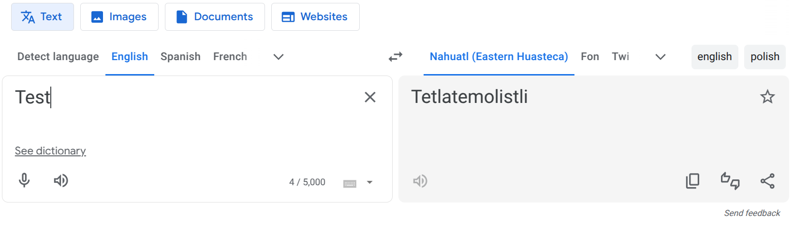
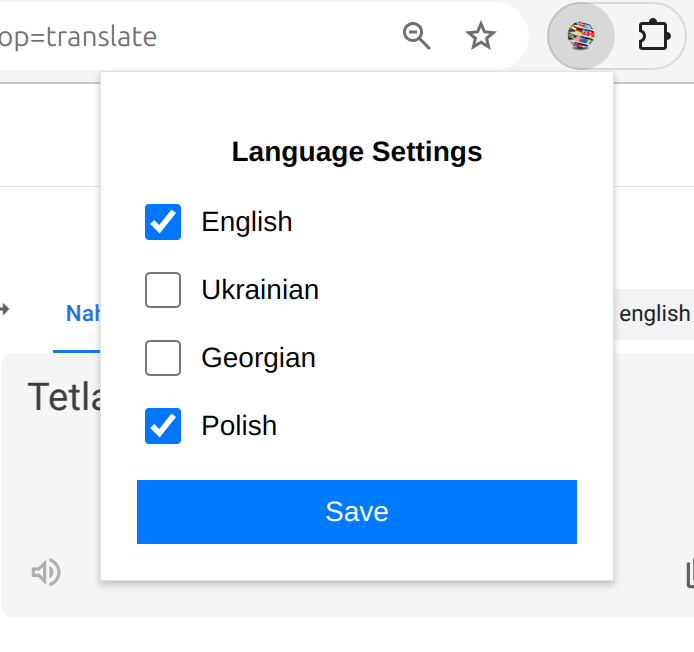

# Language Preferences Chrome Extension
A simple Chrome extension to allow customizing the language options on the Google Translate page.
By default, Google Translate shows only 3 buttons with the last selected languages. But who wants to keep only 3 buttons when you could have a whole row of them? Yeah, this extension is made for these bad boys.

## Screenshots

## Features
- Compatible with Google Translate page (`https://translate.google.com/`).
- Supports only **English** and **Russian** interface languages for now, as the extension matches the needed buttons by their labels.
- Supports only 4 target language buttons for now (en, ua, ka, pl).
- Save and load language preferences using `chrome.storage`.

## Installation
- Clone or download this repository to your local machine.
- Open **Chrome** and navigate to `chrome://extensions/`.
- Enable **Developer mode** (top-right toggle).
- Click on **Load unpacked** and select the **folder** where the extension's files are located.

## Usage
- The extension displays customizable target language buttons on the Google Translate page.
- The user can toggle which languages are visible by saving their preferences (click on the extension icon in the top bar).

### File Structure
- **popup.html**: A form for inputting API details.
- **popup.js**: Handles the popup window for the extension, allowing users to select and save language preferences.
- **background.js**: Listens for messages and coordinates tasks like updating language buttons across open tabs.
- **content.js**: Script that interacts with the Google Translate page.

### Roadmap
- More target languages to choose
- Support for more interface languages

## License
This project is open-source and available under the [MIT License](https://opensource.org/licenses/MIT).
